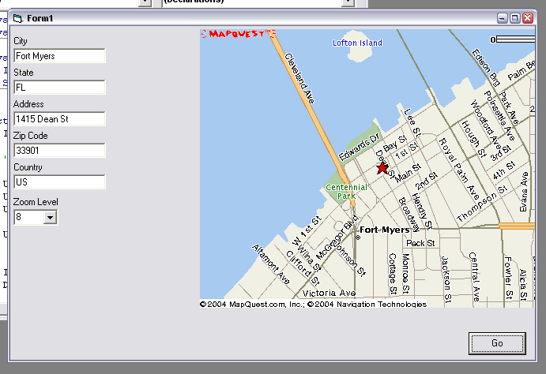



## MapQuest map image extractor

### Description

This code extracts the map image from MapQuests website by pulling the htm page, parsing the source code, and then downloading the gif file and saving it to your computer. Users can input city, state, zip, address, country, and zoom level (0 - 9) to retrieve an image.
 
### More Info
 
an image file from MapQuest

when downloading the page or gif file, VB might freeze up until it has completed the download. If you have code that can download the files without freezing up, it will be very easy to switch between my inet module and yours

             |
---                |---
**Submitted On**   |2004-02-17 20:53:00
**By**             |[Mark Anthony Entingh](https://github.com/Planet-Source-Code/PSCIndex/blob/master/ByAuthor/mark-anthony-entingh.md)
**Level**          |Advanced
**User Rating**    |5.0 (10 globes from 2 users)
**Compatibility**  |VB 3\.0, VB 4\.0 \(32\-bit\), VB 5\.0, VB 6\.0
**Category**       |[Internet/ HTML](https://github.com/Planet-Source-Code/PSCIndex/blob/master/ByCategory/internet-html__1-34.md)
**World**          |[Visual Basic](https://github.com/Planet-Source-Code/PSCIndex/blob/master/ByWorld/visual-basic.md)
**Archive File**   |[MapQuest\_m1710082172004\.zip](https://github.com/Planet-Source-Code/mark-anthony-entingh-mapquest-map-image-extractor__1-51825/archive/master.zip)

